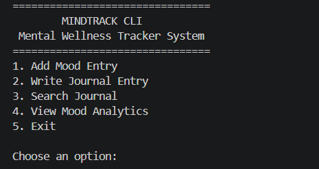
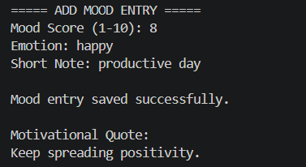
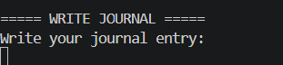
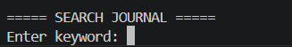
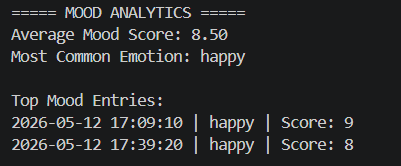

# MindTrack CLI

## Project Title
MindTrack CLI – Mental Wellness Journal and Mood Tracker

---

## Brief Description

MindTrack CLI is a Command Line Interface (CLI) application developed using Python that helps users monitor and reflect on their emotional wellness.

The application allows users to:
- record daily moods,
- write journal entries,
- search reflections,
- analyze emotional patterns,
- and receive motivational quotes based on emotions.

This project demonstrates the use of:
- Object-Oriented Programming (OOP),
- file handling,
- data structures,
- algorithms,
- and error handling in Python.

---

# Features List

## 1. Add Mood Entry
Users can:
- input a mood score from 1–10,
- specify their emotion,
- add a short personal note.

The system also provides motivational quotes based on the entered emotion.

---

## 2. Write Journal Entry
Users can write and save personal reflections or daily experiences.

---

## 3. Search Journal Entries
Users can search journal records using keywords.

---

## 4. View Mood Analytics
The application analyzes mood records and displays:
- average mood score,
- most common emotion,
- top mood entries.

---

## 5. Error Handling
The system handles:
- invalid menu choices,
- invalid numeric inputs,
- missing files,
- invalid mood score ranges.

---

# Installation / Setup Steps

## Step 1: Clone the Repository

```bash
git clone <https://github.com/manpili-cmyk/Pili_Ma.Nicole_FinalProject.git>
```

---

## Step 2: Open the Project Folder

```bash
cd Pili_Ma.Nicole_FinalProject
```

---

## Step 3: Run the Program

```bash
python src/main.py
```

---

# Project Structure

```
PILI_MA.NICOLE_FINALPROJECT/
│
├── README.md
├── requirements.txt
├── .gitignore
│
├── data/
│   ├── journals.json
│   └── moods.json
│
├── images/
│   ├── add_mood.png
│   ├── journal_search.png
│   ├── main_menu.png
│   ├── mood_analytics.png
│   └── write_journal.png
│
└── src/
    ├── main.py
    ├── models.py
    ├── storage.py
    └── wellness.py

---

# Sample CLI Usage

## Main Menu


## Add Mood Entry
 

## Write Journal


## Journal Search


## Mood Analytics


---

# Technologies Used

- Python 3
- JSON File Storage
- Command Line Interface (CLI)

---

# YouTube Video Demonstration

https://youtu.be/m-ade1LVF9k?si=YCV2U2bgN7gPLoST

---

# Author

Name: Ma. Nicole Pili
Course: BSCS 1A
Project: Final Python CLI Project
